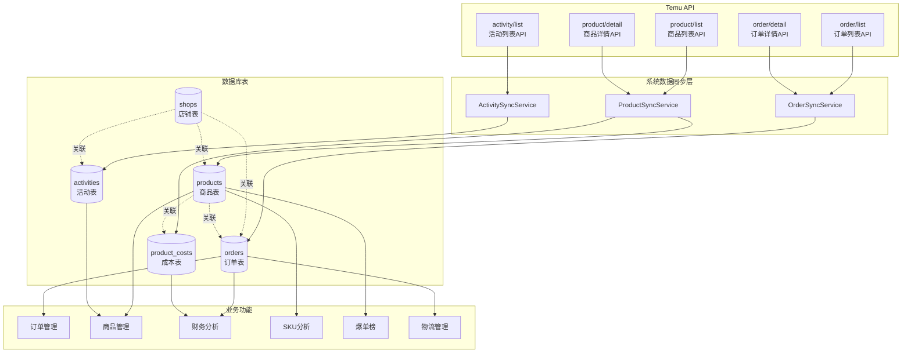
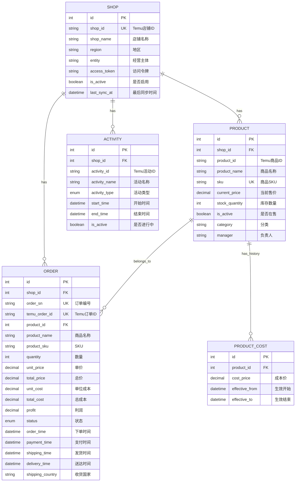
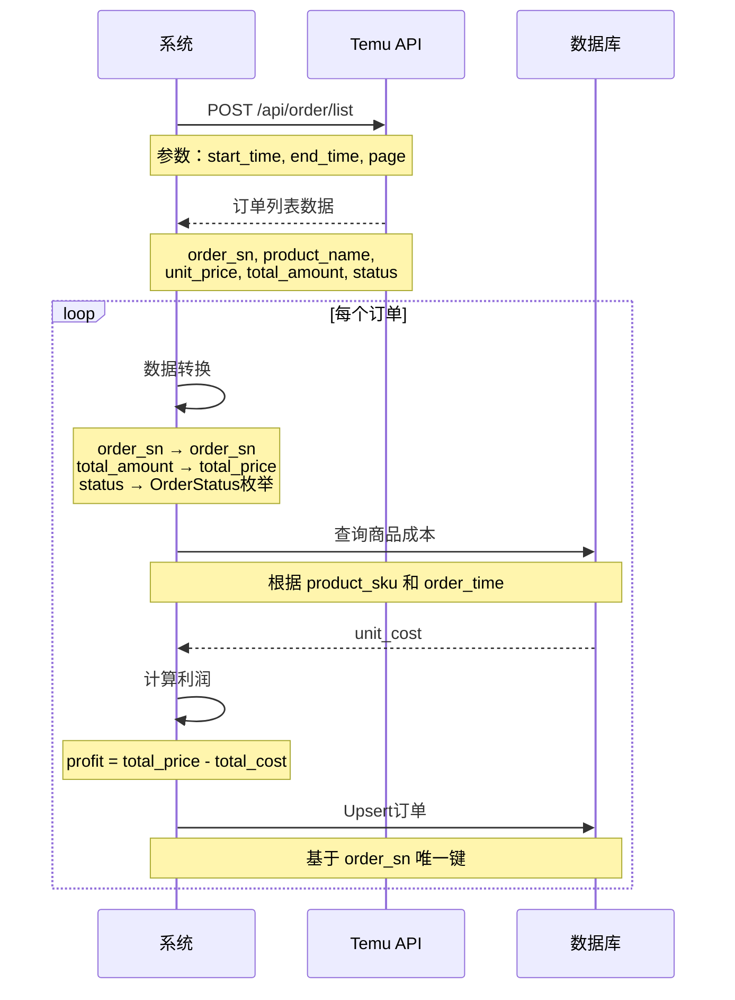
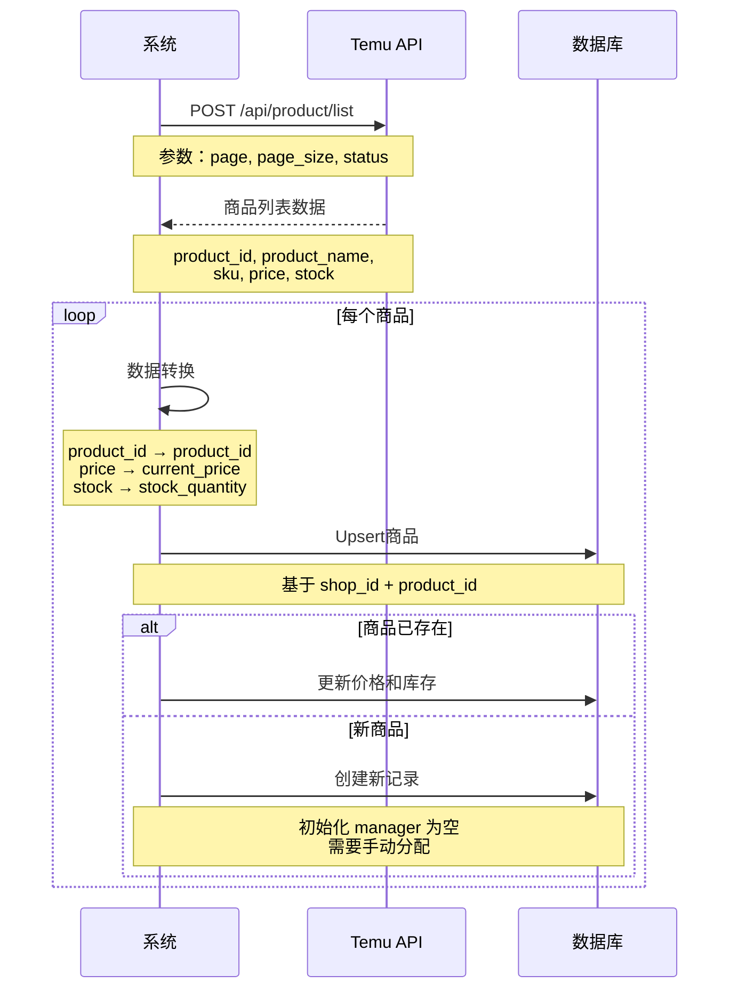

# 📊 API与数据结构映射图

## Temu API ↔️ 系统数据流图

## 数据实体关系图 (ERD)

## API 请求与响应映射

### 1. 订单API映射

### 2. 商品API映射

## 数据字段详细映射表

### Order 数据映射

| Temu API 字段 | 类型 | 系统字段 | 数据库类型 | 转换说明 |
|--------------|------|---------|-----------|---------|
| order_sn | string | order_sn | VARCHAR(100) | 直接映射 |
| order_id | string | temu_order_id | VARCHAR(100) | 直接映射 |
| product_name | string | product_name | VARCHAR(500) | 直接映射 |
| sku | string | product_sku | VARCHAR(200) | 直接映射 |
| quantity | integer | quantity | INTEGER | 直接映射 |
| unit_price | decimal | unit_price | NUMERIC(10,2) | 金额格式化 |
| total_amount | decimal | total_price | NUMERIC(10,2) | 金额格式化 |
| currency | string | currency | VARCHAR(10) | 直接映射 |
| status | string | status | ENUM | 转为OrderStatus枚举 |
| order_time | timestamp | order_time | DATETIME | Unix时间戳转换 |
| payment_time | timestamp | payment_time | DATETIME | Unix时间戳转换 |
| shipping_time | timestamp | shipping_time | DATETIME | Unix时间戳转换 |
| delivery_time | timestamp | delivery_time | DATETIME | Unix时间戳转换 |
| customer_id | string | customer_id | VARCHAR(100) | 直接映射 |
| shipping_country | string | shipping_country | VARCHAR(50) | 直接映射 |
| - | - | unit_cost | NUMERIC(10,2) | **系统计算** |
| - | - | total_cost | NUMERIC(10,2) | **系统计算** |
| - | - | profit | NUMERIC(10,2) | **系统计算** |

### Product 数据映射

| Temu API 字段 | 类型 | 系统字段 | 数据库类型 | 转换说明 |
|--------------|------|---------|-----------|---------|
| product_id | string | product_id | VARCHAR(100) | 直接映射 |
| product_name | string | product_name | VARCHAR(500) | 直接映射 |
| sku | string | sku | VARCHAR(200) | 直接映射 |
| price | decimal | current_price | NUMERIC(10,2) | 金额格式化 |
| currency | string | currency | VARCHAR(10) | 直接映射 |
| stock | integer | stock_quantity | INTEGER | 直接映射 |
| status | boolean/string | is_active | BOOLEAN | 状态转布尔值 |
| description | string | description | TEXT | 直接映射 |
| image_url | string | image_url | VARCHAR(500) | 直接映射 |
| category | string | category | VARCHAR(200) | 直接映射 |
| - | - | manager | VARCHAR(100) | **手动录入** |

### Activity 数据映射

| Temu API 字段 | 类型 | 系统字段 | 数据库类型 | 转换说明 |
|--------------|------|---------|-----------|---------|
| activity_id | string | activity_id | VARCHAR(100) | 直接映射 |
| activity_name | string | activity_name | VARCHAR(500) | 直接映射 |
| activity_type | string | activity_type | ENUM | 转为ActivityType枚举 |
| start_time | timestamp | start_time | DATETIME | Unix时间戳转换 |
| end_time | timestamp | end_time | DATETIME | Unix时间戳转换 |
| status | string | is_active | BOOLEAN | 根据时间判断 |
| description | string | description | TEXT | 直接映射 |

## 系统扩展字段说明

### 扩展字段来源

| 字段 | 所属表 | 来源 | 用途 |
|------|--------|------|------|
| manager | products | **手动录入** | 业绩统计、爆单榜 |
| unit_cost | orders | **系统计算**（来自product_costs） | 利润计算 |
| total_cost | orders | **系统计算**（unit_cost × quantity） | 利润计算 |
| profit | orders | **系统计算**（total_price - total_cost） | 财务分析 |
| cost_price | product_costs | **手动录入** | 成本管理 |
| effective_from | product_costs | **手动录入** | 成本历史 |
| effective_to | product_costs | **手动录入** | 成本历史 |

## 数据同步策略

### 同步频率

```mermaid
gantt
    title 数据同步时间线
    dateFormat HH:mm
    axisFormat %H:%M
    
    section 订单数据
    API调用（30分钟/次）     :a1, 00:00, 30m
    API调用                  :a2, 00:30, 30m
    API调用                  :a3, 01:00, 30m
    
    section 商品数据
    API调用（1小时/次）      :b1, 00:00, 1h
    API调用                  :b2, 01:00, 1h
    
    section 活动数据
    API调用（6小时/次）      :c1, 00:00, 6h
```

### 同步优先级

| 数据类型 | 同步频率 | 优先级 | 原因 |
|---------|---------|--------|------|
| 订单 | 30分钟 | ⭐⭐⭐ | 实时性要求高 |
| 商品 | 1小时 | ⭐⭐ | 价格、库存变化 |
| 活动 | 6小时 | ⭐ | 变化频率低 |

## 待确认的API能力

### 🔴 高优先级（必需）

1. **订单成本数据**
   - API是否返回成本价？
   - 字段名称：`cost_price` / `purchase_price` ?
   - 如果没有，需要系统内手动维护

2. **物流追踪信息**
   - 订单API是否包含物流单号？
   - 是否有专门的物流追踪API？
   - 字段：`tracking_number`, `carrier_name` ?

3. **手续费信息**
   - 订单API是否包含手续费？
   - 字段：`platform_fee`, `payment_fee` ?
   - 用于准确计算利润

### 🟡 中优先级（重要）

4. **财务结算API**
   - 是否有结算报表API？
   - 是否有资金流水API？
   - 用于财务管理模块

5. **商品销量统计**
   - 商品API是否包含销量数据？
   - 字段：`total_sales`, `monthly_sales` ?

### 🟢 低优先级（可选）

6. **Webhook支持**
   - 是否支持订单状态变更推送？
   - 是否支持库存变更推送？

7. **批量API**
   - 是否支持批量查询？
   - 单次最大数量限制？

## 使用建议

1. **先阅读 Temu API 文档**，对照本文档验证API能力
2. **填写"待确认"清单**，标注实际API端点和字段名
3. **更新 ARCHITECTURE.md**，补充验证后的信息
4. **调整代码实现**，根据实际API响应格式修改
5. **完善错误处理**，处理API限流、异常情况

---

**文档状态：** ⚠️ 待验证 Temu API  
**下一步：** 查阅官方文档并更新本文档

